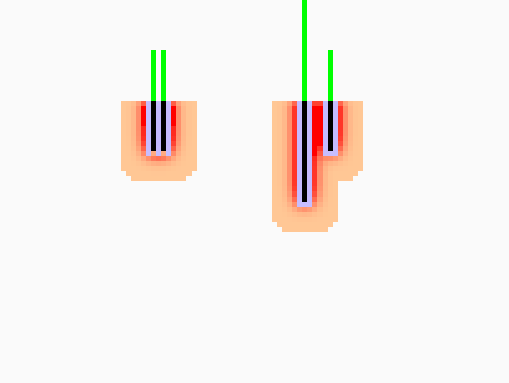
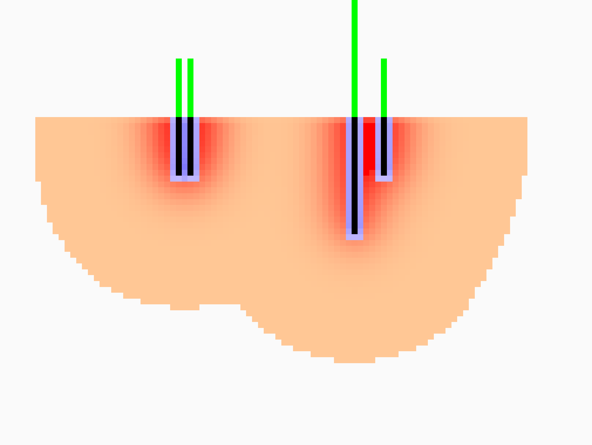
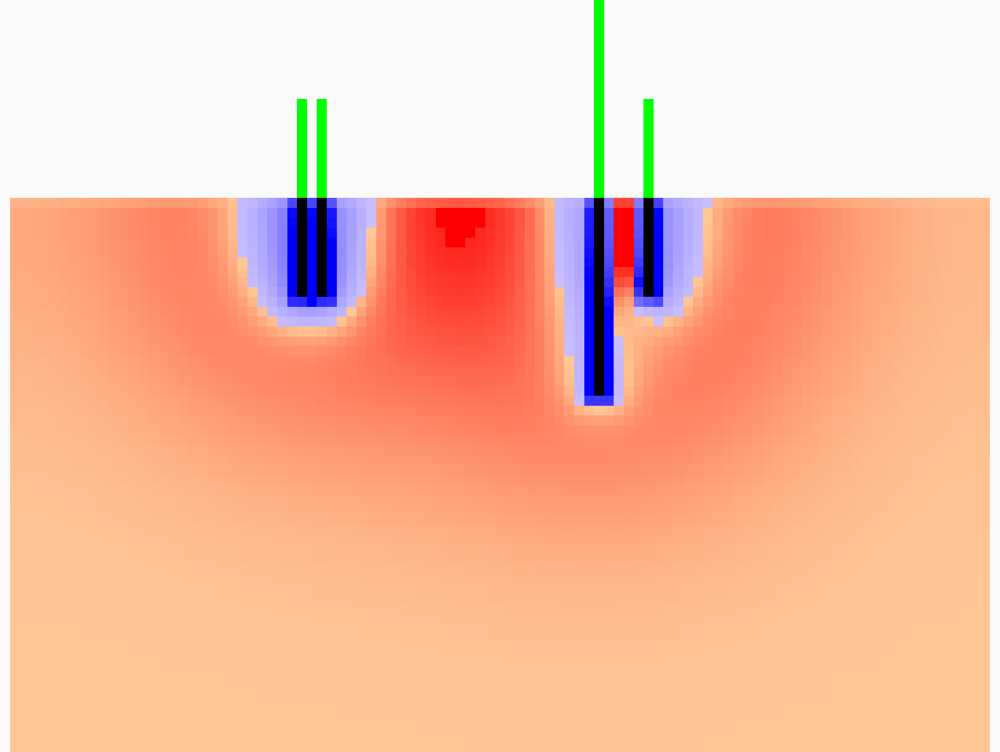
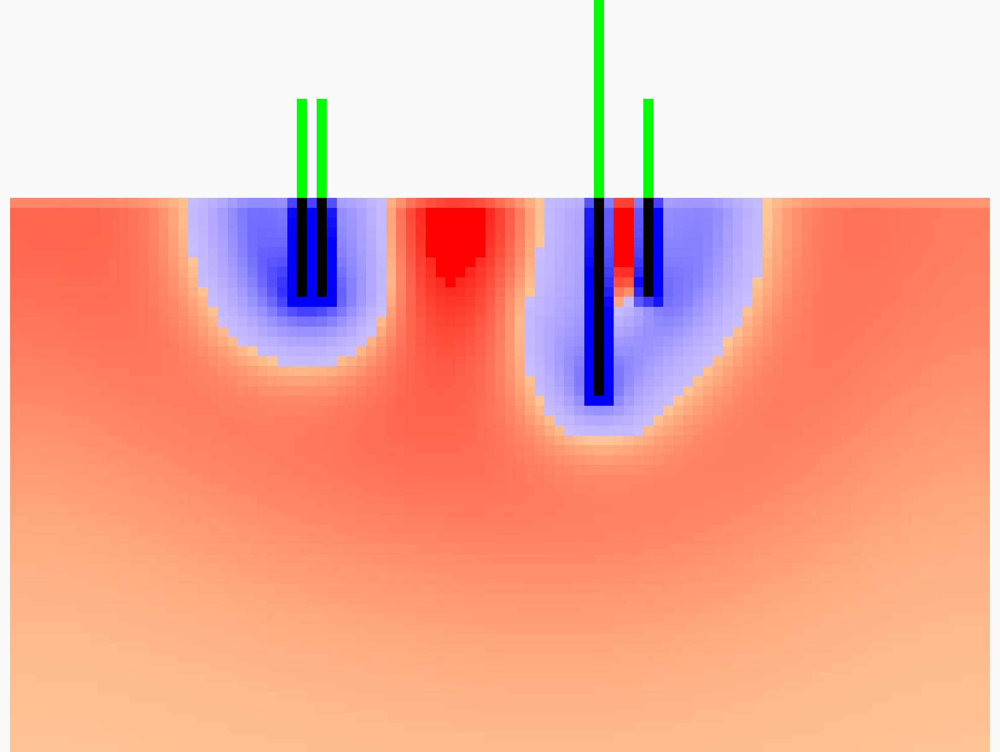
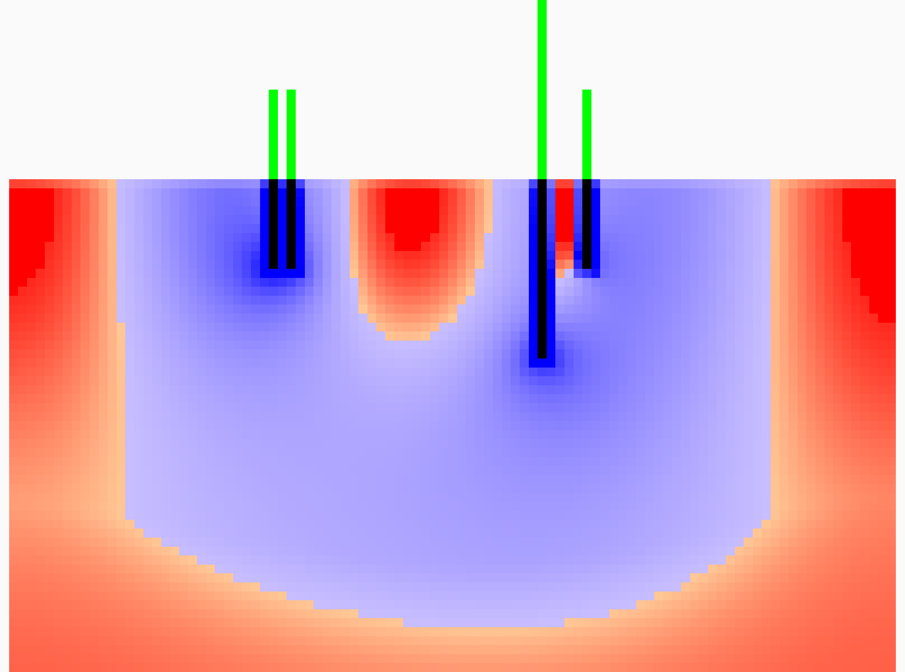
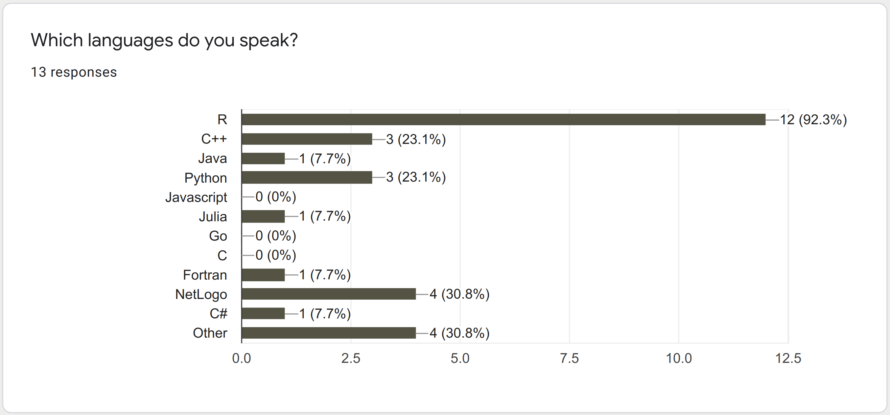
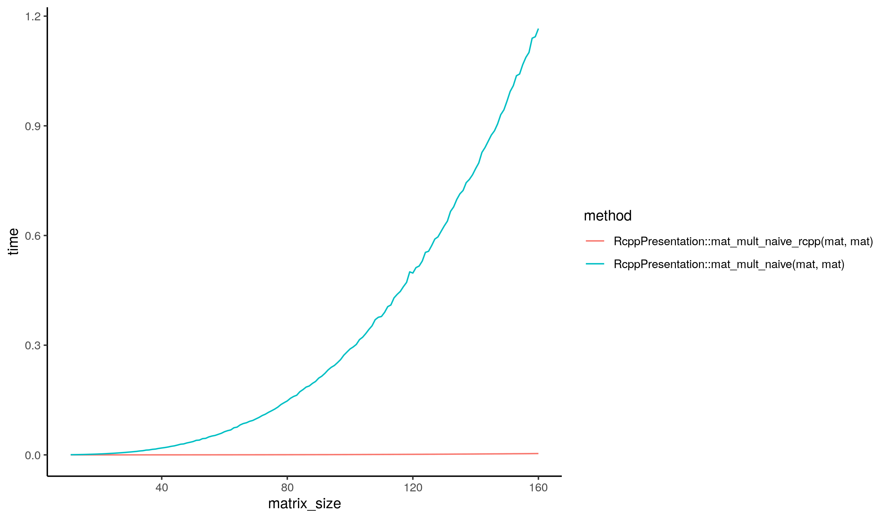

class: inverse, center, middle

# Ecological modeling 🤔

---
class: middle
.center[]

---
class: middle
.center[]

---
class: middle
.center[]

---
class: middle
.center[]

---
class: middle
.center[]

---
class: middle
.center[]

---
class: inverse, center, middle

# `R` + `C++`

---
class: middle
## `R`

- interpreted scripting language
- *from statisticians for statisticians*
- especially popular in science

---
## R in Ecology*
.center[]

.left[
   
`*` mini-survey at the Young Modelers in Ecology Workshop 2020]

---
class: middle
## `C++`

- compiled language with very mature compilers
- offers all control you'll ever need
- modern `C++` even offers some convenience

---
class: inverse, center, middle

# `R` + `C++` = ❤

---
class: middle
## Motivation I
### (the `R` perspective)

--
- performance.

---
## Typical bottlenecks in `R` that `C++` can address 

--
- **Loops** that can’t be easily vectorised because subsequent iterations
depend on previous ones.

--
- **Recursive functions**, or problems which involve calling functions
millions of times. The overhead of calling a function in C++ is much
lower than in R.

--
- Problems that require **advanced data structures and algorithms** that R
doesn’t provide. Through the standard template library (STL), C++
has efficient implementations of many important data structures,
from ordered maps to double-ended queues.

--
[copy’n’pasted from https://adv-r.hadley.nz/rcpp.html]

---
class: middle



---
class: middle
## Motivation II
### (the `C++` perspective)

--
- workflow convenience 
(pre- and post-processing of data is done in R anyway)
- community usefulness 
- (actual) reproducibility

---
class: inverse, center, middle
# But... why does this work?!

---
class: middle
## `R`
- implemented in `C` (and `C++` is compatible with `C`)

--
- R’s API allows to access the underlying objects via C-Pointers
(“SEXP”)

--
- dynamic libraries (.so or .dll) can be made available to `R `

---
class: middle
## `Rcpp`
`Rcpp` is a `C++` and convenience wrapper for the `R`’s API:

--
- `C`-Pointers become STL-like containers, e.g. `NumericVector`,
`IntegerMatrix`

--
- `R`-objects, e.g. `List`, `DataFrame`

--
- Access to `R` functionality, i.e. important math and statistics functions
from `R`

--
- Syntactic sugar for (some) `R` syntax in `C++`, e.g. `sample()`, is `na()`,
`lapply()`

---
class: inverse, center, middle
# But... why does this work?!
## ... in practice?

---
class: middle
## `Rcpp` - Single function

```r
library(Rcpp)

cppFunction('int add(int x, int y, int z) {
  int sum = x + y + z;
  return sum;
}')

add(1, 2 ,3)
# > [1] 6
```

---
class: middle
## But, wait ... what just happened 🤔
`Rcpp::cppFunction()` 

--
- (1) compiled and linked a new shared library for `R` (w our `C++` fun)

--
- (2) defined an `R` function that calls the `add()` function from the new library

---
class: middle
## My stuff is more complex ...

---
class: middle
## `C++` code in .cpp/.h files

```c++
// [[Rcpp::export]]
int add(int x, int y, int z) 
{
    int sum = x + y + z;
    return sum;
}

```

---
class: middle
## `C++` code in .cpp/.h files
```r
library(Rcpp)

sourceCpp(file = "src/add.cpp")

> add(1, 2, 3)
[1] 6
```

---
class: middle
## Don't want to call `sourceCpp()` for each function?
🡆 make an R 📦 package with Rcpp. It is not very complicated 😎

---
class: center, middle

# Thanks!

✉️ sebastian@hanss.info

🐦 @Sebastian_Hanss